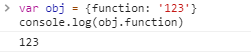
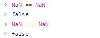
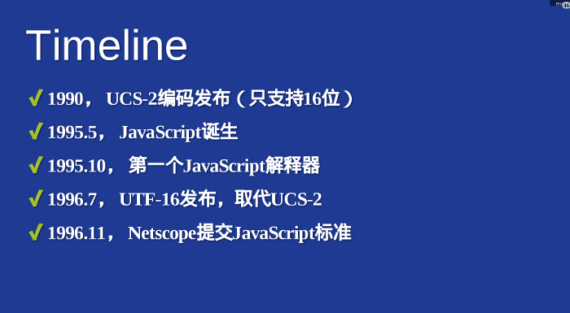
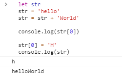

# 精读《JavaScript 语言精粹》之语法

> 重学前端核心语法之精读《JavaScript 语言精粹》

## 一、注释

### 问：在 JavaScript 中有几种注释方式？

答：有两种，分别是单行注释 `//` 以及块注释 `/* */`

### 问：在使用注释的时候应该注意哪些事项？

答：注释，从字面上的意思理解就是对已有代码进行解释，我认为，在编写注释的过程中需要注意以下几点：

1. 写注释的第一要素就是要帮助人们理解代码。
2. 注释中对于代码的描述一定要简短但精确。
3. 注释不是越多越好，反而是越少越好。
4. 不要对注释产生依赖心理，一个简单高效的函数是不需要从头到尾进行注释的。
5. 对于多余和无用的代码，直接删除，不要使用块注释对代码进行注释。

   ```js
    // 在使用块注释时，若代码里有正则表达式，可能会出现无法全部注释代码的情况
    /*
        var regex = /a*/.match(s)
    */
   ```

6. 当修改了代码后一定要及时更新注释，否则多次修改代码并未更新注释后，注释将彻底无用，甚至会引起阅读人员对于代码的误解。

## 二、标识符

### 问：什么是标识符？

答：标识符，是对`JavaScript`中的变量、函数、属性、参数进行命名，给它们起一个专属于它们自己的名字，在相同的作用域内，不会存在重复的标识符。

### 问：标识符的命名规则？

答：标识符的名称中可以出现四种字符 `字母、数字、下划线、美元符号`，但是请注意以下几点：

1. 标识符的第一个字符不可以是数字。
2. 通常我们使用驼峰命名法对两个及以上单词进行命名，例如获取数据的函数名称可以命名为：`function getData () {...}`
3. 不可以将保留字用做变量、函数、参数的名称。
4. ~~当对象的属性是保留字时，只能通过中括号+字符串的形式读取其属性值，例如：`obj['boolean']`~~
5. 经过测试，现代浏览器(Chrome/Firefox/Edge)可以使用点运算符提取对象的属性，即使该属性是保留字。<br>
  
6. 尽管对象的属性可以命名为保留字，但是最好最好**不要去触碰保留字**。

## 三、数字

### 问：JavaScript 中有几种数字类型？

答：只有一种：在 JavaScript 中不区分整数和浮点数，只有`Number`类型，都是浮点数，它采用了`IEEE754`标准的`64`位双精度格式。

### 问：这种数字类型有什么优点？

答：好处就是`JavaScript`实际上都是在用相同的数字类型进行计算，不会出现短整数的溢出问题，避免了一大堆因为数字类型导致的错误。

### 问：这种数字类型有什么缺点？

答：会产生一些计算上的精度问题：

```js
  // 0.1 + 0.2 的计算结果，并不是 0.3
  console.log(0.1 + 0.2) // 0.30000000000000004
  // 2.07 - 1 的计算结果，并不是 1.06
  console.log(2.07 - 1) // 1.0699999999999998
```

### 问：只有 JavaScript 才有浮点数计算误差吗？

答：`JavaScript` 使用的是 `IEEE754` 标准来表示整数和浮点数值，所以并不是只有 `JavaScript` 才有，所有使用 `IEEE754` 标准的编程语言都会有浮点数计算误差现象。

### 问：为什么会产生浮点数计算误差的问题？

答：因为在计算机面前所有东西都会被处理成`二进制`。

#### 原因一：十进制转二进制

有些`十进制`小数，无法用有限的`二进制`浮点数表示，只能用无限循环的`二进制`浮点数表示，`十进制`的`0.1`在转换为`二进制`后会变成无限循环的浮点数`0.0001100110011001100110011001100110011001100110011...`，所以在截断后必然会产生误差。

#### 原因二：二进制浮点数运算时

以加法为例，二进制的浮点数在进行加法运算时，分为下面几个步骤：

- 对阶
  - 顾名思义就是对齐阶码，使两数的小数点位置对齐，小阶向大阶对齐；
- 位数求和
  - 对阶完对尾数求和
- 规格化
  - 尾数必须规格化成指定的形式
- 舍入
  - 在规格化时会损失精度，所以用舍入来提高精度，常用的有`0`舍`1`入法，置`1`法
- 校验判断
  - 最后一步是校验结果是否溢出。若阶码上溢则置为溢出，下溢则置为机器零

`二进制`浮点数的加法计算，**在规格化时会损失精度，所以用舍入来提高精度，这也是造成`二进制`浮点数计算产生误差的原因之一。**

### 问：1e3 在计算时表示什么意思？

答：科学计数法，计算过程如下：
$$1e3 => 1 * 10^3 => 1000$$

### 问：NaN 到底是个什么东西？

答：`NaN`，是属于`Number`类型的，一个特殊的数值，意思是非数值（Not a Number），它表示了在计算的过程中出现了一些不可以进行计算的值，例如：`'blue' * 3` 就会返回一个 `NaN`。`NaN`具有以下特性：

1. NaN 不等于任何值，包括它自己本身。<br>
  
2. 任何与`NaN`有关的计算，计算结果都会返回`NaN`。
3. 我们可以使用全局函数 `isNaN()` 来判断一个值是不是 NaN。
4. `isNaN()` 方法，首先会尝试将传入的参数转为 Number 类型，若可以转换为数值类型，返回 `false`，反之不可以转换为数值类型的值都会返回 `true`

## 四、字符串

### 问：为什么在 JavaScript 中 4 个字节的字符都会当做两个双字节处理？

答：`JavaScript`这个语言被创建的时候，使用的字符集，是一个`16`位`二进制`数的字符集（`UCS-2`，`UTF-16`的前身），所有的字符在`JavaScript`中都是`2`个字节（`1`个字节包含`8`位`二进制`数），如果是`4`个字节的字符，会当做两个双字节的字符处理。



### 问：怎么理解 "字符串是不可变的" 这句话？

答：每个字符串在被创建的时候，都被写入到了物理地址中，一旦写入就不可更改，唯一可以更改的只有变量的指向。

```js
  let str // 创建一个变量 str
  str = 'hello' // 开辟一个物理地址A，将 'hello' 存入，将变量 str 指向物理地址 A
  str = str + 'World' // 开辟一个物理地址B，将 'helloWorld' 存入，将变量 str 指向物理地址 B

  // 可以通过中括号的方式读取字符串中的值
  console.log(str[0]) // 'h'

  // 此时若我们修改 str 变量中字符串的值，并打印，值不变
  str[0] = 'H'
  console.log(str)  // 'helloWorld'
```



### 问：除了字符串，JavaScript 中不可更改的数据类型还有哪些？

答：`JavaScript` 中所有的基本数据类型（`String`、`Number`、`boolean`、`null`、`undefined`）都是不可更改的。

## 五、语句

### 问：switch 语句中的 expression 和 case 的比较是什么比较？

答：严格比较，也就是 `===` 全等运算符。

### 问：如果 switch 语句中有多个 case 匹配上了，怎么办？

答：选择匹配的第一个。

### 问：for in 语句和 Object.keys() 以及 Object.getOwnPropertyNames() 方法的区别？  

答：区别主要是以下几点：

1. `for in` 语句会遍历一个对象中所有可枚举属性 `enumerable` 为 `true` 的属性，包括来自原型链上的属性，搭配 `Object.hasOwnProperty` 方法可以实现 `Object.keys` 的效果。
2. `Object.keys` 方法会遍历一个对象中所有可枚举属性 `enumerable` 为 `true` 的属性，但不包括这个对象原型链上的属性，返回一个数组。
3. `Object.getOwnPropertyNames` 方法会遍历一个对象中所有的属性，忽略 `enumerable` 属性的值，同样也不包含原型链上的属性，返回一个数组。

```js
  // 创建一个对象 parent ，自身属性 name 为可枚举属性
  let parent = Object.create(Object.prototype,{
    name: {
      value: 'parent',
      writable: true,
      enumerable: true,
      configurable: true
    }
  })

  // 以 parent 为原型创建对象 child ，自身属性 sex 可枚举， age 属性不可枚举
  let child = Object.create(parent, {
    sex: {
      value: 'man',
      writable: true,
      enumerable: true,
      configurable: true
    },
    age: {
      value: 18,
      writable: true,
      enumerable: false,
      configurable: true
    }
  })

  // 使用 for in 方法遍历 child 对象
  for (let key in child) {
    console.log(key)
  }
  // > "sex"
  // > "name"

  // 使用 for in + hasOwnProperty 属性模仿 Object.keys 方法
  for (let key in child) {
    let array = []
    if(child.hasOwnProperty(key)){
      array.push(key)
    }
  }
  // > ["sex"]

  // 使用 Object.keys 方法
  console.log(Object.keys(child))
  // > ["sex"]

  // 使用 Object.getOwnPropertyNames 方法
  console.log(Object.getOwnPropertyNames(child))
  // > ["sex","age"]

```

### 问：label 语句是什么，有什么用？

答：`label`语句可以对循环进行标记，是 `break` 和 `continue` 的好兄弟。

```js
// 使用 break label 的语法，我们可以跳过和退出多层循环，而不只是当前循环
function foo (){
  dance:
  for(let k = 0; k < 10; k++){
    for(let m = 0; m < 10; m++){
      if(m === 2){
        continue dance
      } else if(m === 5){
        break dance
      }
    }
  }
}
```

### 问：介绍一下 break、continue、return 相同点以及各自的功能？

答：他们都是流控制语句，功能各有不同：

1. `break` 语句用来退出循环，结合 `label` 语句可以退出多层循环。
2. `continue` 语句用来跳过当前循环，结合 `label` 语句可以跳过多层循环。
3. `return` 语句用来中断当前函数的执行并返回一个值，如果 `return` 后没有返回值，默认返回 `undefined`。

## 参考信息

1. [计算机基础知识：什么是位、字节、字、KB、MB](https://www.cnblogs.com/myseagull/archive/2008/08/09/1264131.html)
2. [Unicode与JavaScript详解 - 阮一峰的网络日志](http://www.ruanyifeng.com/blog/2014/12/unicode.html)
3. [javascript - 怎么理解ECMAScript中的字符串是不可变的？ - SegmentFault 思否](https://segmentfault.com/q/1010000002586121)
4. [理解JavaScript字符串的不可变性 | w3cschool](https://www.w3cschool.cn/codecamp/understand-string-immutability.html)
5. [属性的可枚举性和所有权 - JavaScript | MDN](https://developer.mozilla.org/zh-CN/docs/Web/JavaScript/Enumerability_and_ownership_of_properties)
6. [js对象中什么是可枚举性(enumerable)？ - 演技熊 - SegmentFault 思否](https://segmentfault.com/a/1190000002953364)
7. [详解forin，Object.keys和Object.getOwnPropertyNames的区别](https://yanhaijing.com/javascript/2015/05/09/diff-between-keys-getOwnPropertyNames-forin/)
8. [label - JavaScript | MDN](https://developer.mozilla.org/zh-CN/docs/Web/JavaScript/Reference/Statements/label)
9. [javascript break指定标签，打破多层循环 - 一蓑烟雨的专栏 - CSDN博客](https://blog.csdn.net/u011320646/article/details/18501417)
10. [浮点算术：争议和限制 — Python 3.8.0 文档](https://docs.python.org/zh-cn/3/tutorial/floatingpoint.html)
11. [浮点数精度之谜 - 知乎](https://zhuanlan.zhihu.com/p/28162086)
