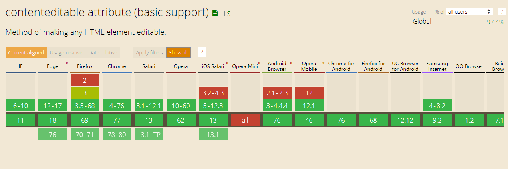
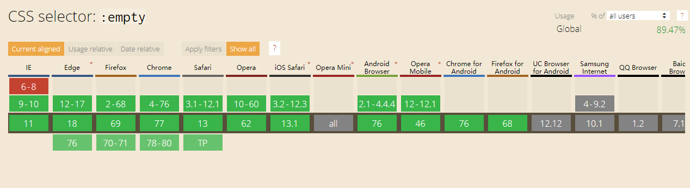
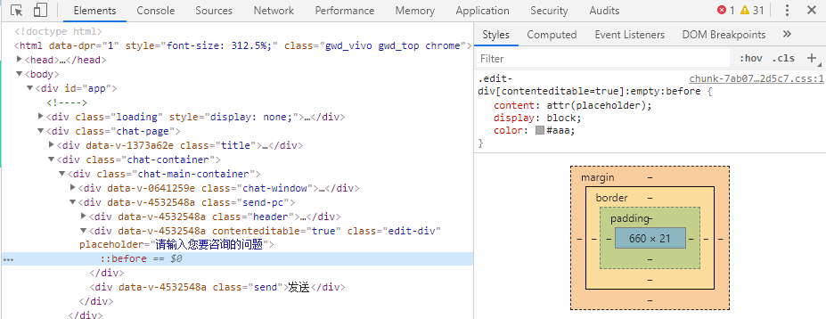
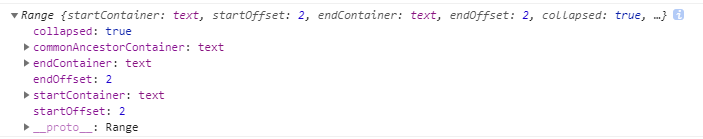
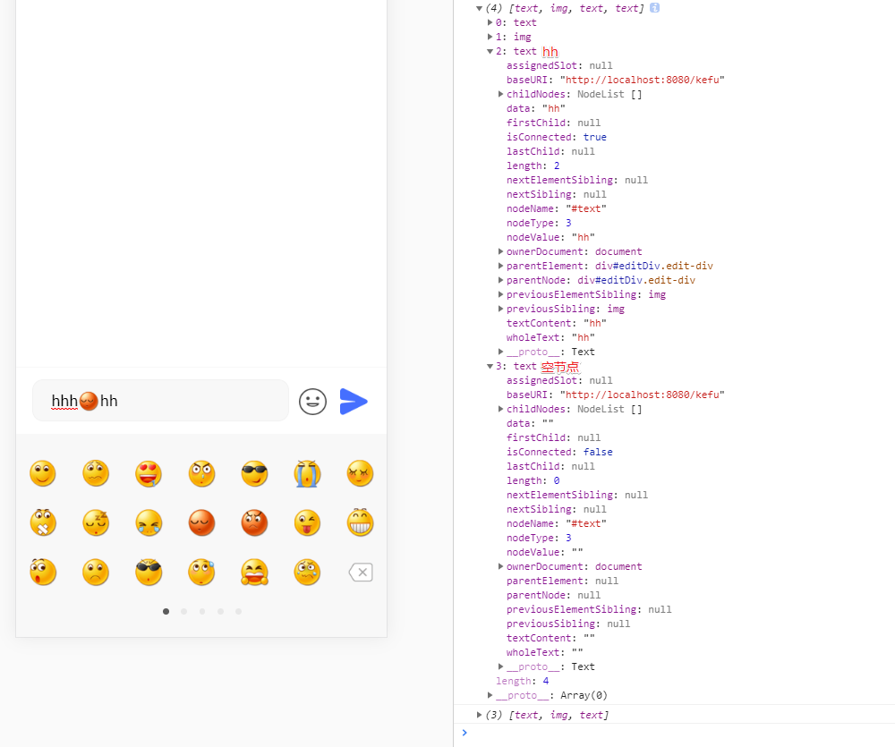

# 一、介绍

在最近的项目开发中，第一次接触了可编辑 div 的功能，在其中踩了许许多多的坑，也学到了很多关于这方面的知识，特此整理了一份总结分享出来。

## 二、相关知识

1. contenteditable 是一个 HTML5 属性，值可以是 true、false 或者是空字符串
2. “该属性是一个枚举属性，而非布尔属性。这意味着必须显式设置其值为 `true`、`false` 或空字符串中的一个，并且不允许简写为 `<label contenteditable>Example Label</label>`正确的用法是 `<label contenteditable="true">Example Label</label>`。” — MDN
3. 经过测试，contenteditable 属性可以简写:

   3.1: IE 和 火狐浏览器会自动设置为 `<div contenteditable = ""></div>`

   3.2: 谷歌浏览器在 `<div contenteditable ></div>` 时也会生效
4. 兼容性： IE6+、谷歌火狐 Safari 都支持



## 三、具体应用

### 1. 模拟 placeholder 属性

因为 contenteditable 只是一个 html 属性，所以它不能让一个 div 元素支持 placeholder 属性，这时候就需要我们自己实现一个 placeholder 的效果了。

模拟 placeholder 属性，我们使用 CSS 的 :empty ，兼容性 ≥ IE9

注意：IE 浏览器下 focus 时的光标可能会在 placeholder 文字的最后，若要解决这个问题，可以在获取焦点时重置伪元素的 content 属性。

图例：



代码：

```html
<-- HTML -->
<div
  contenteditable="true"
  placeholder="请输入您要咨询的问题"
  calss="edit-div"
></div>
```

```css
// less
.edit-div {
  &:empty:before {
    content: attr(placeholder);
    display: block;
    color: #aaaaaa;
  }
  // IE浏览器下 focus 时清空 content
  &.ie:empty:focus::before {
    content: ' ';
    display: block;
  }
}
```

### 2. 获取编辑区域光标对象

想要对编辑栏里面的内容进行操作之前，我们首先需要获取到编辑栏里面的光标对象。

- **划重点：当编辑栏获取焦点时，才能够正确的获取我们想要的光标对象！**

  ```js
  /**
   * 获取页面上的光标位置，并返回 range 对象
   */
  function getRangePosition() {
    let range
    // window.getSelection 方法会返回一个 Selection 对象，表示用户选择的文本范围或光标的当前位置。
    let sel = window.getSelection && window.getSelection()
    if (sel && sel.rangeCount > 0) {
      range = sel.getRangeAt(0)
    }
    return range
  }
  ```

- range 对象，是一个只读的对象，里面所有的属性都是只读的

  

  ```js
  let range = {
      // 光标开始和结束的位置是否一致
      collapsed: true
      // 光标开始节点和光标结束节点的共有祖先节点，取最大公约数
      commonAncestorContainer: text
      // 光标结束所在的节点
      endContainer: text
      // 光标结束位置在 endContainer 中偏移的值
      endOffset: 2
      // 光标开始所在的节点
      startContainer: text
      // 光标可似乎位置在 startContainer 中偏移的值
      startOffset: 2
      __proto__: Range
  }
  ```

### 3. 只输入纯文本

若是不加限制，编辑栏里的内容将会以富文本的形式进行编辑，在粘贴的时候也会将样式以行内样式的形式写进标签里面，发送到服务器后，服务器无法识别内容，不符合我们在线客服的需求，所以需要限制只能输入和粘贴纯文本信息。

#### 3.1 我们可以在粘贴内容时读取粘贴板中的文字

```js
let copyText = (e.clipboardData || window.clipboardData).getData('text')
```

#### 3.2 除了使用 JavaScript 自定义功能之外，在使用 webkit 内核的浏览器中还有两种简单的方法实现

- 设置 html5 属性值：

  ```html
  <div contenteditable="plaintext-only"></div>
  ```

- 设置 css 样式：

  ```css
  .edit-div {
    -webkit-user-modify: read-write-plaintext-only;
  }
  ```

### 4. 向编辑栏中插入 html 片段

这个方法是插入表情的核心功能，作用就是将一段 String 格式 html 片段，插入到编辑栏的光标后面。

- 向一个可编辑的 DIV 中插入一个 html 片段，必须已经获取了编辑栏的 range 对象
- 使用 Range.createContextualFragment 方法将字符串转换为一个 html 片段
- 插入 html 片段后，需要将光标位置移动到插入的片段最后，而非编辑栏的最后

```js
/**
 * 将一个 html 片段插入到可编辑元素的光标后面
 * @param {Object} rangeObj 一个已经实例化的 range 对象
 * @param {String} str 即将插入的 html 片段
 * @param {Boolean} noIndex 插入后是否显示光标
 */
function insertNode(rangeObj, str, hideIndex) {
  // 若传进来的 range 无 createContextualFragment 方法，创建一个
  if (
    typeof Range !== 'undefined' &&
    !Range.prototype.createContextualFragment
  ) {
    Range.prototype.createContextualFragment = function(html) {
      let frag = document.createDocumentFragment()
      let div = document.createElement('div')
      frag.appendChild(div)
      div.outerHTML = html
      return frag
    }
  }
  // 创建 selection 实例
  let selection = window.getSelection()
  // 创建即将插入的 html 片段 — String 类型
  let insertDom = str
  let fragment = rangeObj.createContextualFragment(insertDom)
  // 获取最后一个元素
  let LastNode = fragment.lastChild
  // 插入DOM
  rangeObj.insertNode(fragment)
  // 更新光标位置
  rangeObj.setEndAfter(LastNode)
  // 合并开始光标和结束光标
  rangeObj.collapse(false)
  // 移除 window 内所有光标
  selection.removeAllRanges()
  // 将光标定位在编辑栏
  !hideIndex && selection.addRange(rangeObj)
}
```

### 5. 自定义 ctrl + enter 换行功能

换行功能，在各个浏览器中的实现方式都是不同的，解决方法就是我们我们限制编辑栏只能输入纯文本，统一插入 `<br>` 标签即可，但是在改为添加 `<br>` 之后，此时换行后在展示的时候却会随之而来出现一些问题：

- 自定义换行功能的时候，浏览器的行为很迷：
  - 输入文字再删除后，始终会有一个 br 删不掉，无法展示 placeholder
  - 换行后如果最后一个元素不是 br，光标并不会换行
- 换行后，还需要手动滚动到编辑栏的最底部

具体可以参照下图：


解决方法如下：

```javascript
browserBugFix () {
    // 如果当前编辑框为空，添加一个 br
    !this.$el.lastChild && this.$el.appendChild(document.createElement('br'))

    // 如果编辑框最后一个元素不是 br，添加一个br
    this.$el.lastChild &&
        this.$el.lastChild.nodeName !== 'BR' &&
        this.$el.appendChild(document.createElement('br'))
},
onKeyup (e) {
    // 解决 chrome 浏览器无法清除最后一个 br 的问题
    e.keyCode === 8 &&
      this.$el.innerHTML === '<br>' &&
      (this.$el.innerHTML = '')
},
onkeydown(e){
    if (e.keyCode == 13 || e.charCode == 13) {
        if (e.ctrlKey) {
            // ctrl + enter 换行
            // 浏览器bug修复
            this.browserBugFix()
            // 插入换行符
            Utils.tools.insertNode(this.range, '<br>')
            // 移动到底部
            Utils.tools.goBottom(this.$el)
        }
        e.preventDefault()
    }
}
```

### 6. 插入表情

插入表情有两种情况：

- 未获取到光标时：创建一个 img 标签，直接添加在编辑栏的最后
- 已获取到光标时：先创建一个包含 img 标签的字符串，然后使用 insertNode 方法，直接将字符串转换为 html 片段并插入到光标的后面
- IE9 浏览器不支持直接设置 img.style ，需要使用 setAttribute 设置属性
- IE9 浏览器会自动给 img 标签加上 width 和 height 属性，需要手动设置这两个属性的值

```js
/**
  * 插入表情
  */
addEmoji(index) {
    // 如果获取不到光标，直接添加在最后
    if (this.rangeObj) {
        let imgHtml = ``

        Utils.tools.insertNode(this.rangeObj, imgHtml)
    } else {
        let img = document.createElement('img')
        img.src = 'data:image/png;base64,iVBORw0KGgoAAAANSUhEUgAAAAEAAAABAQMAAAAl21bKAAAAA1BMVEUAAACnej3aAAAAAXRSTlMAQObYZgAAAApJREFUCNdjYAAAAAIAAeIhvDMAAAAASUVORK5CYII='
        img.alt = CONSTANTS.PC_EXPRESSION_LIST[index]
        // 兼容IE9
        img.setAttribute('style', Utils.emoji.getPosition(index))
        img.width = '23'
        img.height = '23'

        this.editDom.appendChild(img)

        Utils.tools.setIndexEnd(this.editDom)
        Utils.tools.goBottom(this.editDom)
    }
}
```

### 7. 粘贴表情

**原生的粘贴表情会将表情的样式也带出来，不可使用，需要自己实现。**

实现方法：

- 先将粘贴板内容中的内容提取出来并转换为纯文本
- 若内容中有 img 标签，则会自动将 img 标签转换为其 alt 属性的值
- 遍历表情库并和粘贴板中的文本进行匹配，匹配成功后将表情文字还原为 img 标签

```js
// 粘贴表情时文字转换为图片
this.editDom.addEventListener('paste', e => {
  e.preventDefault()
  // 获取粘贴板的文字内容，若有 img 标签，将会把 img 标签自动转换为其 alt 属性的值
  let copyText = (e.clipboardData || window.clipboardData).getData('text')
  // 遍历已有的表情库，和粘贴板中的表情文字进行匹配并替换
  CONSTANTS.PC_EXPRESSION_LIST.forEach((item, index) => {
    let reg = new RegExp('\\' + item, 'g')
    copyText = copyText.replace(
      reg,
      ``
    )
  })
  // 插入表情
  Utils.tools.insertNode(this.rangeObj, copyText)
  // 设置光标
  Utils.tools.setIndexEnd(this.editDom)
  // 移动到底部
  Utils.tools.goBottom(this.editDom)
})
```

### 8. 退格删除文字和表情功能

**退格功能，要注意的坑有三点：**

1. 获取编辑栏内容的时候，通常在最后都会有一个看不见但是存在的空节点。
2. 当编辑栏中不止有文字还有图片的时候，此时就得先判断最后一个节点，是文字节点还是图片节点。
3. 文字节点需要删除文字内容的最后一个字，而不是整个节点。



解决方法：退格删除文字和表情功能，需要处理的就是编辑栏最后的看不见的空节点，若是编辑栏最后一个节点为空，则递归删除，直到不为空为止。

```js
/**
  * 退格功能
  */
backSpace () {
    if (this.inputVal) {
        // 获取输入框的 DOM
        let editDiv = this.editDom.$el
        // 获取输入框内的所有子元素节点
        let childNodes = [].slice.call(editDiv.childNodes)
        // 获取输入框最后一个节点
        let lastChild = childNodes[childNodes.length - 1]
        // 是否为 #TEXT 节点
        if (lastChild && lastChild.nodeType == 3) {
            // 若是空节点，直接删除
            if (
                lastChild &&
                (lastChild.nodeValue === '' || lastChild.nodeValue === '\n')
            ) {
                editDiv.removeChild(lastChild)
                // 递归调用，直到发现非空白节点或输入框为空
                this.backSpace()
                return
            }
            // 有内容文字节点，删除最后一个字
            let nodeText = lastChild.nodeValue
            lastChild.textContent = nodeText.substring(0, nodeText.length - 1)
        } else {
            // 删除表情
            editDiv.removeChild(lastChild)
        }
    }
}
```

## 四、总结和思考

### 总结

- 相对于 `input`、`textarea` ，使用 `contenteditable` 的好处还是很多的：

  - 输入框高度能够自适应
  - 能够插入图片和表情等内容
  - 编辑器内的一切内容皆可自由编辑
  - DOM 的原生属性，原生就支持很多内容编辑操作，包括光标位移、键盘事件等

- 但是缺点也是很要命的：
  - 浏览器的兼容性差（输入文字和换行时插入的 DOM 节点）
  - 用户行为难以控制
  - 需要自己实现 placeholder 提示语
  - 光标的视觉位置和逻辑位置可能不吻合

### 思考

`contenteditable` 最大的优点，就是它的一切内容皆可自由编辑，但这恰恰也是它最大的缺点，正因为它的内容不可控制，我们难以将它的 DOM 结构和视图模型进行抽象映射。

## 五、参考资料

1. [contenteditable - HTML (超文本标记语言)](https://developer.mozilla.org/zh-CN/docs/Web/HTML/Global_attributes/contenteditable)
2. [小 tip: 如何让 contenteditable 元素只能输入纯文本](https://www.zhangxinxu.com/wordpress/2016/01/contenteditable-plaintext-only/)
