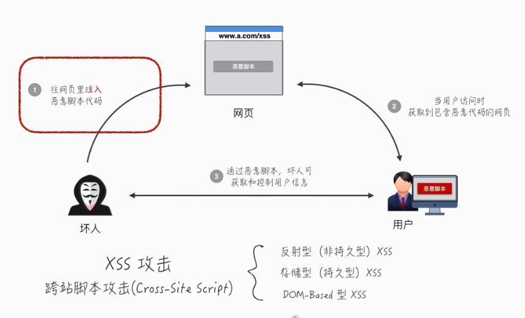
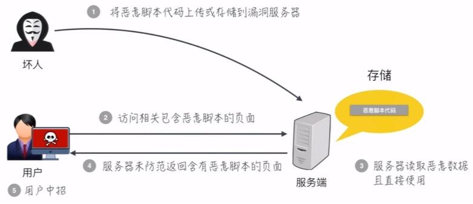
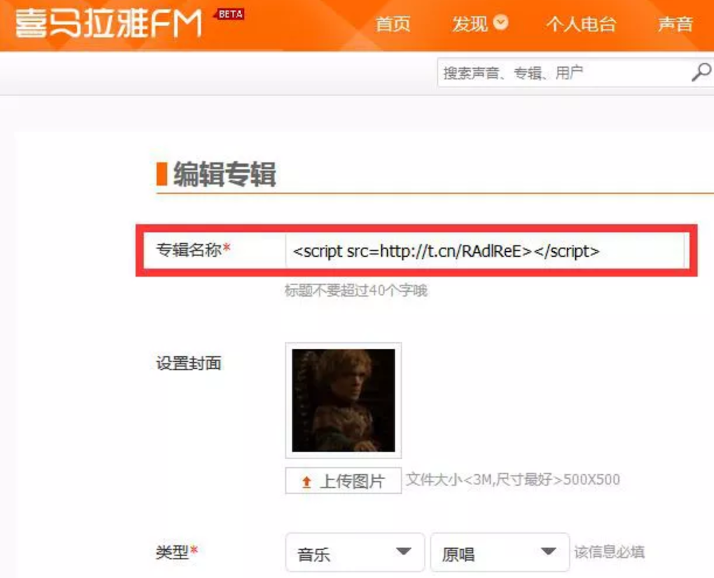
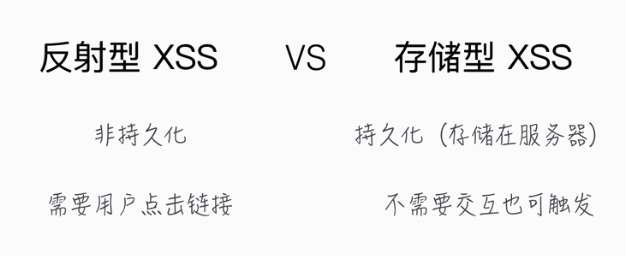
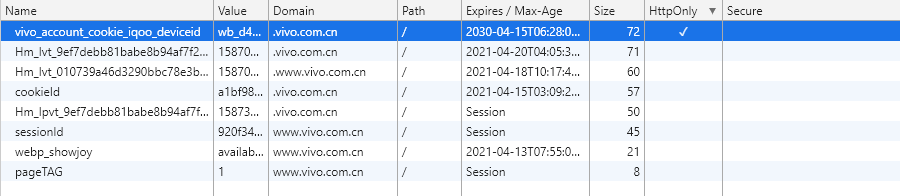

# 从前端的角度去理解 XSS 攻击

## 1. 什么是 XSS 攻击？

XSS 攻击的全名叫做**跨站脚本攻击（Cross-site scripting）**,而具体的操作，是在页面中注入恶意的脚本，从而在用户浏览页面时运行注入的脚本实现跨站脚本攻击。

我们都知道，一个页面中如果想要运行脚本代码，一般是通过`script`标签来实现的，但是有时候还会包括像 `HTML` 、 `Flash` 或者其他浏览器可以运行的代码，而浏览器是无法区分这些脚本是被恶意注入的还是页面本身的脚本内容，所以页面在运行代码的时候，所有脚本都有着相同的权限，而这些权限中有很多是能够访问到用户敏感数据的，例如：

- 使用 `document.cookie` 拿到 `Cookie` 信息
- 使用 `addEventListener` 监听用户的行为
- 伪造 `get` 和 `post` 请求
- 修改页面 `DOM` 伪造假的登录窗口或者生成弹窗广告

这只是最常见的恶意脚本能做的事情，一句话概括就是，如果页面中注入了恶意脚本，那么我们就相当于把页面内的隐私数据和用户行为完全暴露给别人了。

## 2. XSS 攻击有哪些攻击方式？

> **通常情况下，主要有存储型 XSS 攻击、反射型 XSS 攻击以及基于 DOM 的 XSS** 攻击



### 2.1 存储型 XSS 攻击

先来看看 `存储型 XSS 攻击`，这是一种利用网站漏洞将恶意脚本提交到服务器内进行存储等待用户访问相关页面的攻击方式。



通过上面的示例图，我们可以将存储型 XSS 攻击的攻击步骤分为以下几步：

1. 首先，黑客通过网站的漏洞将一段恶意的 `JavaScript` 代码提交到网站的服务器中。
2. 然后浏览网站的用户打开了包含恶意代码的网页。
3. 当用户浏览该页面的时候，恶意脚本就会将用户的隐私数据上传到黑客自己的服务器中。

**那么很关键的一点来了，黑客是怎么将恶意代码提交都网站的服务器上的呢？**

在这里我举几个例子：

第一个例子，它的名字叫 `Samy蠕虫` 。

2005年的10月，`MySpace.com` 网站中一个名叫 `Samy` 的用户，使用了恶意的 `JavaScript` 代码更新他的个人资料，然后当已登录的用户访问了 `Samy` 的主页后，都会运行恶意代码通过浏览器发送 `XHR` 请求，增加 `Samy` 为好友、添加到自己的关注列表中，同时修改了用户的个人资料。

最后受感染的用户超过一百万，`MySpace.com` 被迫关闭网站来方阻止感染、修复漏洞。

第二个例子是国内2015年喜马拉雅被曝出的用户可以在设置专辑名称时提交一段 `JavaScript` 代码，这也是典型的存储型 XSS 漏洞。



当用户打开了这个专辑时，服务器会将这款恶意代码返回给用户，这段恶意脚本也就在用户的浏览器中执行了。

### 2.2 反射型 XSS 攻击

反射型 XSS 攻击，它并不是将恶意代码存储到服务器中，它的攻击方式往往是通过诱导用户去点击一些带有恶意脚本参数的 `URL` 。

**反射型 XSS 攻击单说起来有些抽象，下面用搜索页面举个例子：**

假如我们有一个需求，是做一个搜索页面，然后服务器根据 `URL` 中的参数在页面中返回用户搜索的关键字。

```html
// 写在 ftl 中的代码
<div>
  您搜索的关键词是：${keword}
</div>
```

实现效果如下：

当用户搜索了`XSS 攻击`时，页面跳转到`http://xxx/search?keyword="XSS 攻击“`，并且在页面中显示用户搜索的关键字为 `XSS 攻击`。

```html
// 渲染在浏览器中的 DOM
<div>
  您搜索的关键词是："XSS 攻击"
</div>
```

**此时如果服务器没有对 `URL` 中的参数进行安全过滤**，那么当我们输入了 `<script>alert('XSS');</script>` 之后，会发生什么呢？

首先：页面会跳转到`http://xxx/search?keyword="<script>alert('XSS');</script>"`

然后就中招了：

```html
// 渲染在浏览器中的 DOM
<div>
  您搜索的关键词是："<script>alert('XSS');</script>"
</div>
```

浏览器无法分辨出 `<script>alert('XSS');</script>` 是恶意代码，因而将其执行。

以上就是反射型 XSS 最典型也是最简单的攻击方式案例。

**下面这张图可以清晰地描述反射型 XSS 和存储型 XSS 的区别**



### 2.3 基于 DOM 的 XSS 攻击

不管是反射型 XSS 还是存储型 XSS，中间的步骤都需要经过服务器的解析，而基于 DOM 的 XSS 攻击，则和 WEB 服务器没啥关系，简单来说就是黑客通过各种手段将恶意代码注入到本地页面的 DOM 中，例如通过网络劫持在页面传输数据的过程中修改 HTML 页面的内容，最常见的就是路由器劫持，还有通过本地恶意软件来劫持的手段。

**它们的共同点就是在传输数据的过程中或者在用户使用页面的过程中修改 WEB 页面的数据。**

## 3. 怎么防御 XSS 攻击？

我们已经知道了，**存储型 XSS 攻击**和**反射型 XSS 攻击**都是**需要经过 WEB 服务器**来处理的，因此这两种类型的漏洞可以认为是**服务端的安全漏洞**，而基于 **DOM 的 XSS 攻击**则全是在浏览器客户端完成的，因此是属于**前端的安全漏洞**。

但是，无论是哪种 XSS 攻击，它们都有一个共同点，那就是都需要在浏览器中**注入恶意脚本**， 然后在通过**执行恶意脚本**中的代码实现 XSS 攻击。

所以如果我们想要阻止和防御 XSS 攻击，我们可以通过阻止恶意脚本的注入和恶意脚本的执行来实现。

### 3.1 服务器将输入的脚本进行过滤或者转码

不管是存储型 XSS 攻击还是反射型 XSS 攻击，我们都可以在服务器端将一些关键字符进行过滤或者转码。

```java
code:<script>alert('xss 攻击')</script>
```

对上面的代码的 `<script>` 标签进行过滤后，只会保留

```java
code:
```

这样，当用户再次请求页面的时候，由于恶意代码已经被过滤了，所以这段代码不会再客户端中被执行。

**注意：以上过滤 `<Script>` 只是过滤的其中一种，还有使用 `img` 标签的 `onerror` 属性 、使用  `iframe` 标签编码等手段同样可以实现存储型 XSS 攻击。**

除了过滤之外，服务器还可以对这些内容进行转码，经过转码之后的内容，如 `<script>` 标签被转换为 `&lt;script&gt;` ，因此即使这段脚本返回给页面，页面也不会执行这段脚本。

### 3.2 使用 HttpOnly 属性

之前已经介绍过 XSS 攻击的用途，大多数都是盗用用户的 `cookie` 内容，拿到用户隐私数据、伪装用户登录状态，这时候我们可以通过 `HttpOnly` 属性来保护我们的 `cookie` 的信息安全。

顾名思义，设置了 `HttpOnly` 属性的 `Cookie` 只能够在 `HTTP` 传输过程中使用，无法通过 `JavaScript` 读取，我们可以在 `Chrome` 控制台中看到哪些 `Cookie` 被标记了 `HttpOnly` 。



具体的设置方式是服务器为某些 `Cookie` 设置 `HttpOnly` 的标志，`HttpOnly` 是服务器通过 `HTTP` 响应头来设置的。

由于设置了 `HttpOnly` 属性的 `Cookie` 数据使用 `JavaScript` 无法读取到，所以即使页面被注入了恶意的 `JavaScript` 脚本，也是无法获取到这些数据的。

**注意：设置了 `HttpOnly` 属性后所有脚本都无法获取，包括页面加载的正常脚本。**

### 3.3 充分利用 CSP（内容安全策略）

即使我们能够在服务器端执行安全过滤或者内容转码，以防止 XSS 攻击的发生，但是光靠服务器端依然是不够的，需要服务器和浏览器一起合作。

这个时候我们就需要把 CSP 的安全策略充分利用起来，以降低 XSS 攻击的风险以及带来的后果。

如果需要使用 CSP ，可以通过**服务器的响应头**为页面配置安全策略，也可以通过 `<meta>` 元素配置安全策略。

```html
<meta http-equiv="Content-Security-Policy" content="default-src 'self';">
```

实施严格的 CSP 可以有效地防范 XSS 攻击，具体来讲 CSP 有如下几个功能：

**示例一：限制加载其他域下的资源文件**

```java
// 设置所有内容均来自当前域名（不包含子域名）
Content-Security-Policy: default-src 'self'
```

**示例二：禁止执行内联脚本和非信任主机的脚本**

```java
// 设置必须从特定主机服务器获取可信任的脚本代码，CSP 默认禁止内联脚本执行
Content-Security-Policy: script-src userscripts.example.com
```

**示例三：页面所有内容必须通过 SSL方式获取**

```java
// 设置只能以 https 的方式从指定域名获取资源文件
Content-Security-Policy: default-src https://onlinebanking.jumbobank.com
```

**示例四：将出现异常的页面上报到指定服务器**

```java
// 设置接收违规报告的服务器
Content-Security-Policy-Report-Only: script-src ‘self’; report-uri http://reportcollector.example.com/collector.cgi
```

通过 CSP 我们可以有效的降低 XSS 攻击的风险。

## 4. 总结

XSS 攻击就是一种向页面中注入恶意脚本然后执行，将页面中的重要数据上传到恶意服务器。常见的 XSS 攻击有 `存储型 XSS 攻击`、`反射型 XSS 攻击`、`基于 DOM 的 XSS 攻击`。

这三种攻击方式都需要在页面中注入并执行恶意脚本才能实现，三者的不同点在于有些 `存储型 XSS 攻击` 和 `反射型 XSS 攻击`是通过服务器漏洞来注入的，而 `基于 DOM 的 XSS攻击`是通过网络劫持等手段在客户端直接注入的。

针对 XSS 攻击，主要的防范机制有三种，第一种是通过服务器对输入的内容进行安全过滤或者转码，第二种是使用 `HttpOnly` 保护页面 `Cookie` 隐私数据的安全，第三种是充分利用好 CSP（内容安全策略）。

**参考链接：**

1. [Cross-site scripting（跨站脚本攻击）](https://developer.mozilla.org/zh-CN/docs/Glossary/Cross-site_scripting)
2. [内容安全策略( CSP )](https://developer.mozilla.org/zh-CN/docs/Web/HTTP/CSP)
3. [存储型XSS的攻防：不想做开发的黑客不是好黑客](https://www.freebuf.com/vuls/217092.html)
4. [安全策略之CSP应用](https://blog.csdn.net/rth362147773/article/details/55681301)
5. [XSS](http://static.kancloud.cn/jonjo/jonjo/1025573)
6. [前端安全系列（一）：如何防止XSS攻击？](https://tech.meituan.com/2018/09/27/fe-security.html)
7. [XSS 蠕虫& 病毒即将发生的威胁与最好的防御](https://wizardforcel.gitbooks.io/xss-worms-and-viruses/content/)
